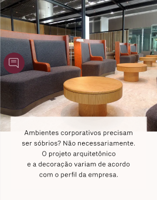

# Nome do Componente
BannerZoom

## Descrição
O `BannerZoom` é um componente que exibe um banner responsivo com suporte a imagens para dispositivos móveis e desktop. Ele possui um efeito opcional de zoom ao passar o mouse e pode incluir uma caixa de descrição com fundo translúcido. É importante ressaltar que o efeito de zoom como é no hover só existe no desktop.

## Previews de Exemplo

### Desktop

### Mobile

## Preview Preenchimento no admin da Deco

## Props
Lista de propriedades aceitas pelo componente e seus tipos.

| Propriedade | Tipo | Obrigatória | Descrição | Valor Padrão |
|------------|------|-------------|------------|---------------|
| `background.mobile.image` | `ImageWidget` | Sim | Imagem de fundo para mobile | - |
| `background.mobile.width` | `number` | Não | Largura da imagem para mobile | `360` |
| `background.mobile.height` | `number` | Não | Altura da imagem para mobile | `800` |
| `background.desktop.image` | `ImageWidget` | Sim | Imagem de fundo para desktop | - |
| `background.desktop.width` | `number` | Não | Largura da imagem para desktop | `1360` |
| `background.desktop.height` | `number` | Não | Altura da imagem para desktop | `760` |
| `background.hoverZoom` | `boolean` | Não | Ativa o efeito de zoom ao passar o mouse | `false` |
| `boxPaddingBottom.desktop` | `number` | Não | Espaçamento inferior do conteúdo no desktop | `116` |
| `boxPaddingBottom.mobile` | `number` | Não | Espaçamento inferior do conteúdo no mobile | `316` |
| `description` | `string` | Não | Conteúdo da caixa de descrição | `""` |

## Considerações
- O `BannerZoom` ajusta dinamicamente o espaçamento inferior (`paddingBottom`) com base no dispositivo.
- Se `hoverZoom` estiver ativado, a imagem terá um efeito de zoom suave ao passar o mouse.
- O componente utiliza `Picture` e `Source` para carregar imagens de forma otimizada para diferentes dispositivos.
- A caixa de descrição, se fornecida, será posicionada na parte inferior do banner com um fundo translúcido.

## Perguntas Frequentes (FAQ)

### O que acontece se eu não definir imagens para mobile ou desktop?
O componente não será renderizado corretamente, pois as imagens são obrigatórias para garantir a exibição do banner.

### Posso ativar o zoom no mobile?
Não, o efeito de zoom ao passar o mouse (`hoverZoom`) só funciona em dispositivos desktop.

### Como funciona o espaçamento inferior do conteúdo?
O `boxPaddingBottom` permite ajustar o espaçamento inferior da caixa de descrição separadamente para desktop e mobile, garantindo um posicionamento adequado do conteúdo.

### A caixa de descrição é obrigatória?
Não, o componente pode ser utilizado sem a descrição, exibindo apenas a imagem de fundo.