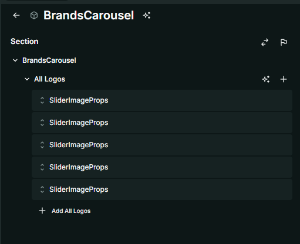
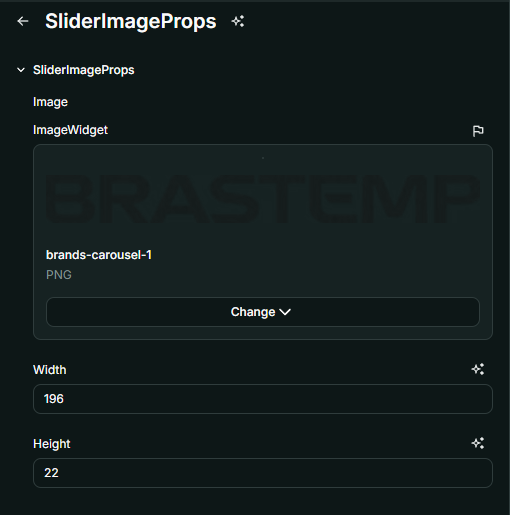

# Nome do Componente
BrandsCarousel

## Descrição
O `BrandsCarousel` é um componente que exibe um carrossel de logos de marcas em um loop infinito, proporcionando uma apresentação fluida e dinâmica. É ideal para destacar parcerias, clientes ou patrocinadores de forma atrativa e responsiva.

## Previews de Exemplo

### Desktop

### Mobile

## Preview Preenchimento no admin da Deco

## Props
Lista de propriedades aceitas pelo componente e seus tipos.

| Propriedade | Tipo | Obrigatória | Descrição | Valor Padrão |
|------------|------|-------------|------------|---------------|
| `allLogos` | `SliderImageProps[]` | Sim | Lista de logos que serão exibidos no carrossel | - |

### `SliderImageProps`

| Propriedade | Tipo | Obrigatória | Descrição |
|------------|------|-------------|------------|
| `image` | `ImageWidget` | Sim | URL da imagem da logo |
| `width` | `number` | Sim | Largura da imagem em pixels |
| `height` | `number` | Sim | Altura da imagem em pixels |

## Considerações
- O `BrandsCarousel` gera um efeito de rolagem infinita para exibição contínua das logos.
- As imagens são carregadas de forma otimizada para melhor desempenho.
- O componente é responsivo, garantindo uma boa exibição em dispositivos móveis e desktop.

## Perguntas Frequentes (FAQ)

### Posso definir diferentes tamanhos para as imagens?
Sim, cada imagem pode ter um tamanho personalizado definindo os valores de `width` e `height`.

### Quantas logos posso adicionar?
Não há um limite fixo, mas recomenda-se um número razoável para evitar sobrecarga no layout e performance.

### Como as imagens são carregadas?
As imagens são carregadas de forma otimizada com `loading="lazy"` e `decoding="async"`, melhorando a performance da página.

