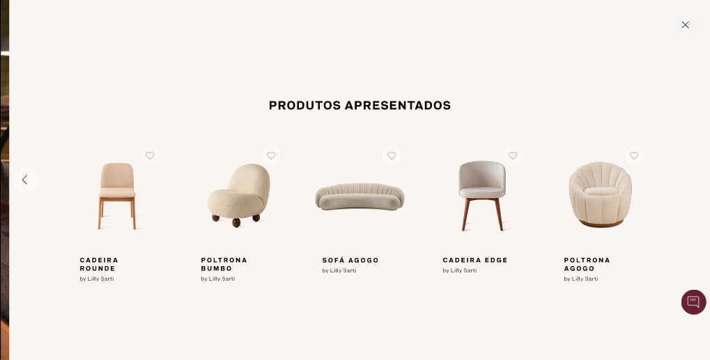
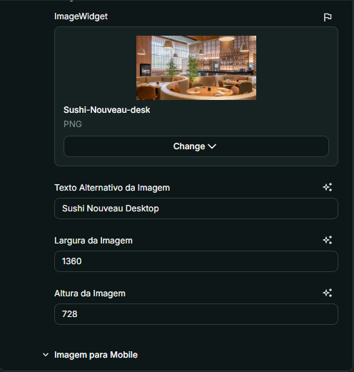

# Nome do Componente
BretonVersatilityCarousel

## Descrição
O `BretonVersatilityCarousel` é um componente de carrossel que exibe diferentes locais com imagens, histórias e produtos associados. Ele permite a filtragem por tipo de local e inclui um botão de "Carregar mais" para exibir mais conteúdo conforme necessário. 

## Previews de Exemplo

### Desktop

### Mobile

## Preview Preenchimento no admin da Deco

## Props
Lista de propriedades aceitas pelo componente e seus tipos.

| Propriedade | Tipo | Obrigatória | Descrição | Valor Padrão |
|------------|------|-------------|------------|---------------|
| `title` | `string` | Sim | Título do carrossel | - |
| `subtitle` | `string` | Sim | Subtítulo do carrossel | - |
| `places` | `PlaceProps[]` | Sim | Lista de locais a serem exibidos no carrossel | - |
| `limitPerPage` | `number` | Não | Limite de slides por página | `6` |

### Estrutura de `PlaceProps`

| Propriedade | Tipo | Obrigatória | Descrição |
|------------|------|-------------|------------|
| `type` | `string` | Sim | Tipo de local |
| `cover` | `CoverSlideProps & CommonSlideProps` | Sim | Capa do local |
| `history` | `HistorySlideProps` | Sim | História do local |
| `normalSlide` | `CommonSlideProps[]` | Sim | Slide de imagens |
| `productsSlide` | `ProductSlideProps` | Sim | Slide de produtos |

### Estrutura de `CommonSlideProps`

| Propriedade | Tipo | Obrigatória | Descrição |
|------------|------|-------------|------------|
| `desktopImage` | `CommonImageProps` | Sim | Imagem para Desktop |
| `mobileImage` | `CommonImageProps` | Sim | Imagem para Mobile |

### Estrutura de `CoverSlideProps`

| Propriedade | Tipo | Obrigatória | Descrição |
|------------|------|-------------|------------|
| `title` | `string` | Sim | Título da Capa |
| `label` | `string` | Sim | Rótulo da Capa |

### Estrutura de `HistorySlideProps`

| Propriedade | Tipo | Obrigatória | Descrição |
|------------|------|-------------|------------|
| `title` | `string` | Sim | Título da História |
| `subtitle` | `string` | Sim | Subtítulo da História |
| `topics` | `TopicsSlideProps[]` | Sim | Tópicos da História |

### Estrutura de `TopicsSlideProps`

| Propriedade | Tipo | Obrigatória | Descrição |
|------------|------|-------------|------------|
| `title` | `string` | Sim | Título do Tópico |
| `text` | `string` | Sim | Texto do Tópico |

### Estrutura de `OnlyImage`

| Propriedade | Tipo | Obrigatória | Descrição |
|------------|------|-------------|------------|
| `image` | `ImageWidget` | Sim | Imagem |
| `alt` | `string` | Sim | Texto Alternativo da Imagem |

### Estrutura de `CommonImageProps`

| Propriedade | Tipo | Obrigatória | Descrição |
|------------|------|-------------|------------|
| `image` | `ImageWidget` | Sim | Imagem |
| `alt` | `string` | Sim | Texto Alternativo da Imagem |
| `width` | `number` | Sim | Largura da Imagem |
| `height` | `number` | Sim | Altura da Imagem |

### Estrutura de `ProductSlideProps`

| Propriedade | Tipo | Obrigatória | Descrição |
|------------|------|-------------|------------|
| `title` | `string` | Sim | Título do Slide de Produtos |
| `products` | `ProductsProps | CollectionProps` | Sim | Produtos do Slide |

### Estrutura de `ProductsProps`

| Propriedade | Tipo | Obrigatória | Descrição |
|------------|------|-------------|------------|
| `productIds` | `string[]` | Sim | IDs dos Produtos (máximo 5) |

### Estrutura de `CollectionProps`

| Propriedade | Tipo | Obrigatória | Descrição |
|------------|------|-------------|------------|
| `collectionId` | `string` | Sim | ID da Coleção |

## Considerações
- O carrossel permite a filtragem por tipo de local usando um seletor.
- O botão "Carregar mais" exibe mais conteúdo dinamicamente.
- Scripts internos gerenciam a interatividade do seletor e a rotação de seta.
- O componente ajusta automaticamente o conteúdo com base no tipo de dispositivo.

## Perguntas Frequentes (FAQ)

### O que acontece se eu não definir locais (`places`)?
O carrossel não será renderizado corretamente, pois os locais são obrigatórios.

### Posso alterar o limite de slides por página?
Sim, o limite pode ser definido na propriedade `limitPerPage`, sendo `6` o valor padrão.

### Como funciona a filtragem de locais?
O carrossel gera automaticamente uma lista de tipos de locais, permitindo que os usuários filtrem o conteúdo através de um menu suspenso.

### O botão "Carregar mais" é obrigatório?
Não, ele só aparece caso existam mais locais a serem exibidos além do limite definido por página.