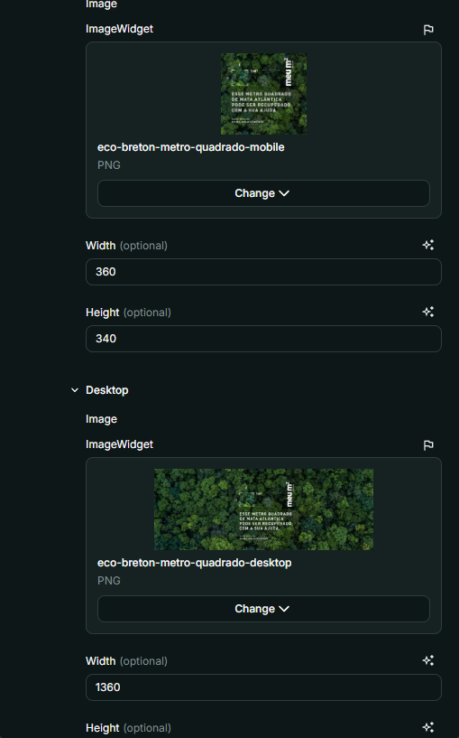
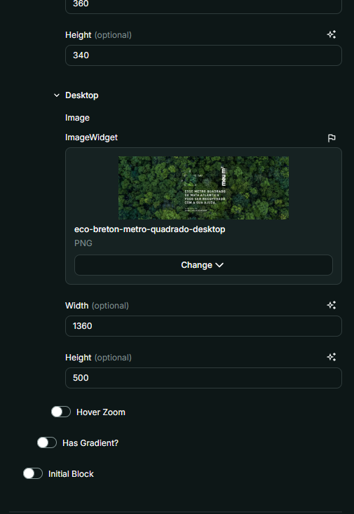

# Nome do Componente
FullBanner

## Descrição
O `FullBanner` é um componente responsável por exibir um banner completo com imagens dinâmicas para dispositivos móveis e desktop, além de suportar título, descrição e imagens adicionais.

## Previews de Exemplo

### Desktop

### Mobile

## Preview Preenchimento no admin da Deco

## Props
Lista de propriedades aceitas pelo componente e seus tipos.

| Propriedade | Tipo | Obrigatória | Descrição | Valor Padrão |
|------------|------|-------------|------------|---------------|
| `content` | `object` | Não | Contém título, descrição e imagens do título | `{}` |
| `background` | `object` | Sim | Contém as imagens de fundo para mobile e desktop | - |
| `initialBlock` | `boolean` | Não | Indica se é o banner inicial da página | `false` |
| `hasGradient` | `boolean` | Não | Adiciona um degradê ao fundo | `true` |

## Considerações
- O `FullBanner` utiliza `useDevice` para determinar o tamanho do dispositivo.
- As imagens são carregadas responsivamente usando `Picture` e `Source`.
- Caso `hasGradient` esteja ativado, um degradê será adicionado ao fundo do banner.
- O `dangerouslySetInnerHTML` é utilizado para renderizar HTML dinâmico no título e descrição, garantindo flexibilidade na formatação do conteúdo.

## Perguntas Frequentes (FAQ)

### O que acontece se eu não definir um `titleImage`?
O banner será exibido normalmente, mas sem uma imagem adicional sobre o título.

### Posso personalizar o degradê?
O degradê ativado por `hasGradient` usa uma classe CSS predefinida (`bg-banner-gradient`). Para personalização, altere o CSS correspondente.

### O que ocorre se eu não definir `background`?
Essa propriedade é obrigatória. O componente não funcionará corretamente sem imagens de fundo definidas.
