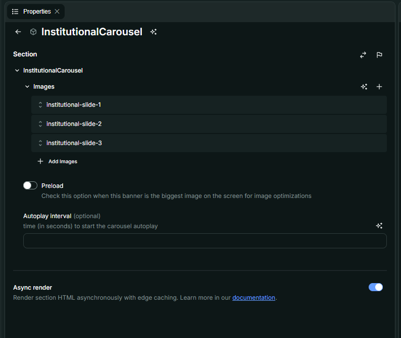
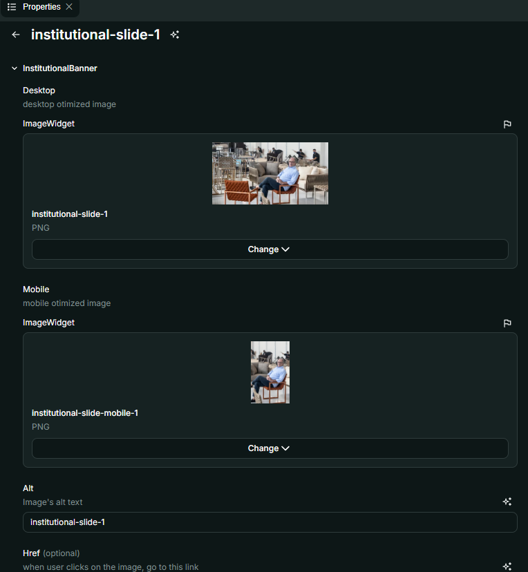
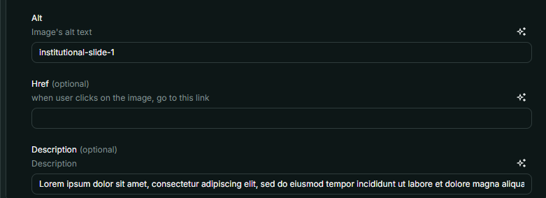

# Nome do Componente
InstitutionalCarousel

## Descrição
O `InstitutionalCarousel` é um componente que exibe um carrossel de banners institucionais, suportando imagens otimizadas para dispositivos móveis e desktop. Ele permite a configuração de autoplay, descrição sobre as imagens e navegação interativa.

## Previews de Exemplo

### Desktop

### Mobile

## Preview Preenchimento no admin da Deco

## Props
Lista de propriedades aceitas pelo componente e seus tipos.

| Propriedade | Tipo | Obrigatória | Descrição | Valor Padrão |
|------------|------|-------------|------------|---------------|
| `images` | `InstitutionalBanner[]` | Não | Lista de imagens que compõem o carrossel | `[]` |
| `preload` | `boolean` | Não | Se marcado, a primeira imagem será carregada com prioridade para otimização | `false` |
| `interval` | `number` | Não | Define o tempo (em segundos) para iniciar o autoplay do carrossel | - |

### Propriedades do InstitutionalBanner
| Propriedade | Tipo | Obrigatória | Descrição |
|------------|------|-------------|------------|
| `desktop` | `ImageWidget` | Sim | Imagem otimizada para desktop |
| `mobile` | `ImageWidget` | Sim | Imagem otimizada para mobile |
| `alt` | `string` | Sim | Texto alternativo para acessibilidade |
| `href` | `string` | Não | Link para onde a imagem redireciona ao ser clicada |
| `description` | `string` | Não | Texto descritivo exibido sobre a imagem |

## Considerações
- O `InstitutionalCarousel` adapta a exibição das imagens de acordo com o dispositivo detectado (`mobile` ou `desktop`).
- A navegação no carrossel pode ser feita via botões laterais ou indicadores de página na parte inferior.
- Caso `preload` esteja ativado, a primeira imagem será carregada com maior prioridade para melhorar o desempenho.
- Se `interval` for definido, o carrossel entrará em autoplay no tempo especificado.

## Perguntas Frequentes (FAQ)

### O que acontece se eu não definir imagens?
O carrossel não será exibido corretamente, pois precisa de pelo menos uma imagem para ser renderizado.

### O autoplay pode ser desativado?
Sim, basta não definir a propriedade `interval` ou atribuir `0` como valor.

### Como a navegação entre slides funciona?
A navegação pode ser feita manualmente pelos botões laterais ou clicando nos indicadores de página na parte inferior do carrossel.

### As imagens são carregadas de forma otimizada?
Sim, o componente utiliza `Picture` e `Source` para carregar imagens de forma responsiva e otimizada para cada dispositivo.

