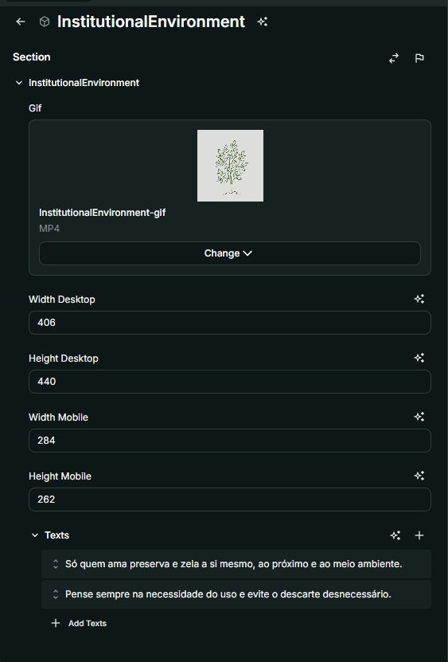

# Nome do Componente
InstitutionalEnvironment

## Descrição
O `InstitutionalEnvironment` é um componente que exibe um GIF institucional acompanhado de textos descritivos. Ele ajusta dinamicamente o tamanho do vídeo para dispositivos móveis e desktop.

## Previews de Exemplo

### Desktop

### Mobile

## Preview Preenchimento no admin da Deco

## Props
Lista de propriedades aceitas pelo componente e seus tipos.

| Propriedade | Tipo | Obrigatória | Descrição | Valor Padrão |
|------------|------|-------------|------------|---------------|
| `gif` | `VideoWidget` | Sim | Arquivo de vídeo/GIF exibido no componente | - |
| `widthDesktop` | `number` | Sim | Largura do vídeo para desktop | - |
| `heightDesktop` | `number` | Sim | Altura do vídeo para desktop | - |
| `widthMobile` | `number` | Sim | Largura do vídeo para mobile | - |
| `heightMobile` | `number` | Sim | Altura do vídeo para mobile | - |
| `texts` | `string[]` | Sim | Lista de textos exibidos ao lado do vídeo | `[]` |

## Considerações
- O `InstitutionalEnvironment` adapta automaticamente o tamanho do vídeo de acordo com o dispositivo detectado.
- Os textos são estilizados e apresentados em letras maiúsculas com espaçamento personalizado.
- O GIF ou vídeo é exibido de forma contínua (`loop`), sem som e com reprodução automática.
- Caso o navegador do usuário não suporte vídeos, uma mensagem de erro será exibida.

## Perguntas Frequentes (FAQ)

### O que acontece se eu não definir um `gif`?
O componente não será renderizado corretamente, pois o GIF é obrigatório para exibição.

### Os textos são opcionais?
Não, a propriedade `texts` é obrigatória e deve conter pelo menos um texto para exibição.

### Como o tamanho do vídeo é ajustado?
O componente verifica se o dispositivo é `mobile` ou `desktop` e ajusta a largura e altura com base nas propriedades `widthMobile`, `heightMobile`, `widthDesktop` e `heightDesktop`.

### Posso adicionar um vídeo no lugar do GIF?
Sim, o `VideoWidget` pode ser utilizado para exibir arquivos de vídeo no formato MP4.

