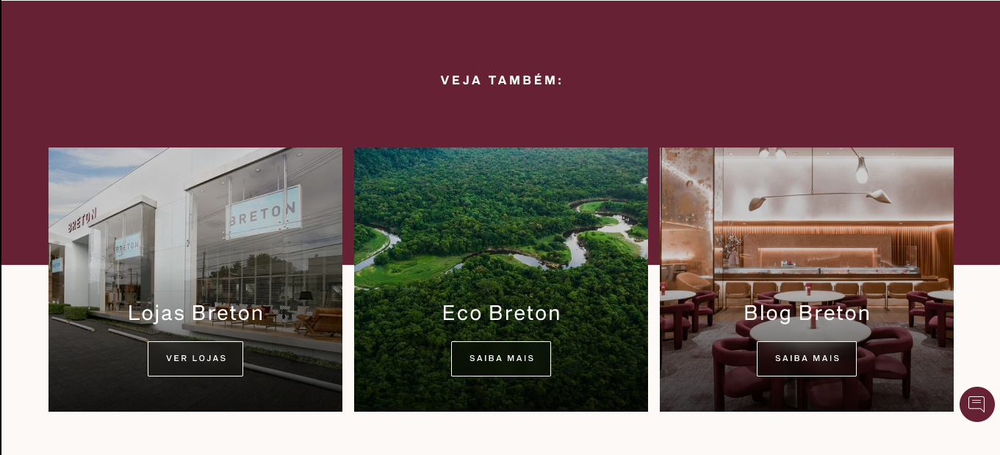
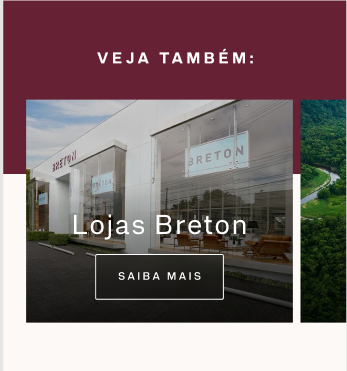
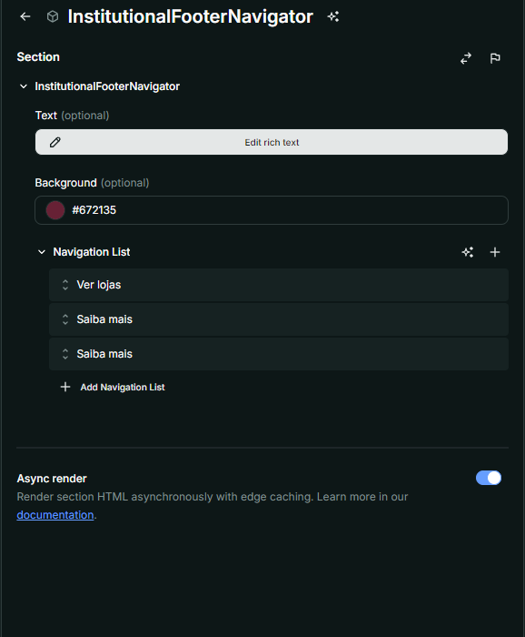
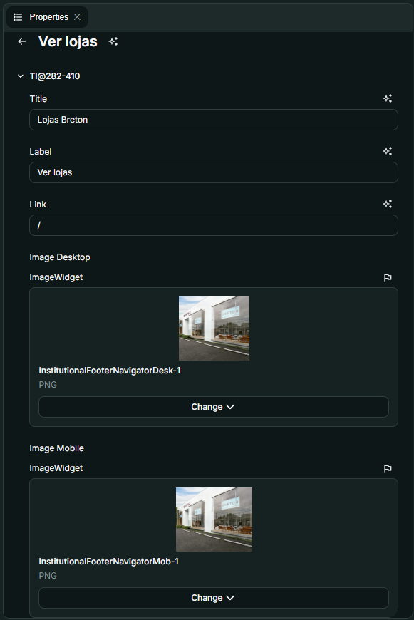

# Nome do Componente
InstitutionalFooterNavigator

## Descrição
O `InstitutionalFooterNavigator` é um componente que exibe um rodapé institucional com links de navegação organizados em formato de banner. Ele permite incluir um texto personalizado, fundo configurável e botões de navegação interativos.

## Previews de Exemplo

### Desktop

### Mobile

## Preview Preenchimento no admin da Deco

## Props
Lista de propriedades aceitas pelo componente e seus tipos.

| Propriedade | Tipo | Obrigatória | Descrição | Valor Padrão |
|------------|------|-------------|------------|---------------|
| `text` | `HTMLWidget` | Não | Texto exibido acima da navegação | `""` |
| `background` | `Color` | Não | Cor de fundo do rodapé | `""` |
| `navigationList` | `NavigationListProps[]` | Não | Lista de itens de navegação | `[]` |

### Propriedades de NavigationListProps
| Propriedade | Tipo | Obrigatória | Descrição |
|------------|------|-------------|------------|
| `title` | `string` | Sim | Título do item de navegação |
| `label` | `string` | Sim | Texto do botão de navegação |
| `link` | `string` | Sim | URL de destino do item |
| `imageDesktop` | `ImageWidget` | Sim | Imagem para desktop |
| `imageMobile` | `ImageWidget` | Sim | Imagem para mobile |

## Considerações
- O `InstitutionalFooterNavigator` permite configurar um texto superior com suporte a HTML.
- Cada item de navegação inclui uma imagem para desktop e outra para mobile, garantindo responsividade.
- Os botões de navegação possuem efeito de desfoque no fundo para melhor legibilidade.
- O componente ajusta automaticamente os espaçamentos laterais para o primeiro e último item da lista.

## Perguntas Frequentes (FAQ)

### O que acontece se eu não definir `navigationList`?
O rodapé será exibido sem os banners de navegação, mostrando apenas o texto superior (se definido).

### Como funciona o fundo do rodapé?
A propriedade `background` permite definir a cor de fundo do rodapé, podendo ser personalizada conforme a necessidade.

### As imagens são carregadas de forma otimizada?
Sim, o componente exibe imagens específicas para desktop e mobile para garantir melhor desempenho e experiência do usuário.

### Os botões podem ser estilizados?
Os botões já possuem um estilo predefinido com transparência e borda branca, mas podem ser ajustados via CSS personalizado.

