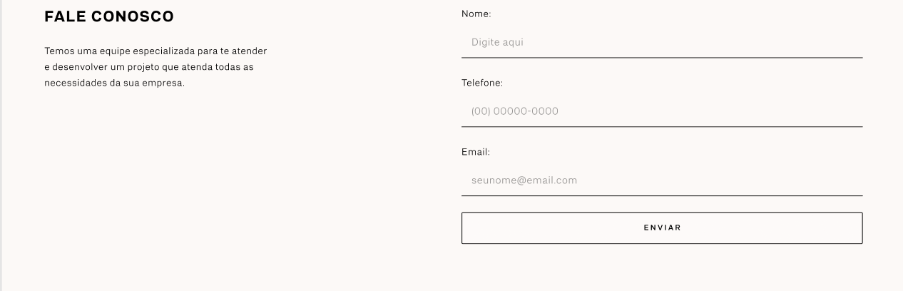
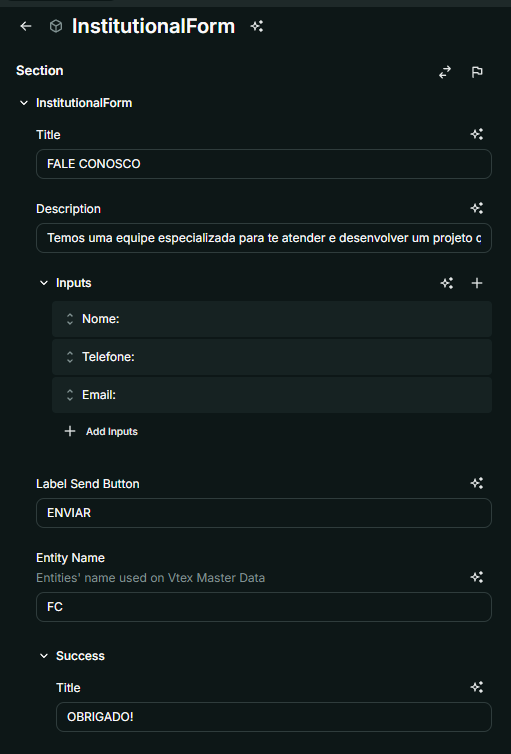
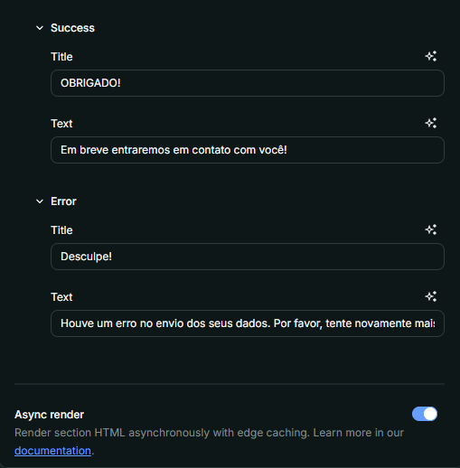

# Nome do Componente
InstitutionalForm

## Descrição
O `InstitutionalForm` é um componente de formulário institucional que permite capturar e enviar informações para a plataforma VTEX Master Data. Ele exibe campos personalizados, mensagens de sucesso e erro, e realiza a submissão via API.

## Previews de Exemplo

### Desktop

## Preview Preenchimento no admin da Deco

## Props
Lista de propriedades aceitas pelo componente e seus tipos.

| Propriedade | Tipo | Obrigatória | Descrição |
|------------|------|-------------|------------|
| `title` | `string` | Sim | Título do formulário |
| `description` | `string` | Sim | Descrição do formulário |
| `inputs` | `InstitutionalFormInputGroupProps[]` | Sim | Lista de campos do formulário |
| `labelSendButton` | `string` | Sim | Texto do botão de envio |
| `entityName` | `string` | Sim | Nome da entidade no VTEX Master Data |
| `success` | `InstitutionalFormMessageProps` | Sim | Mensagem de sucesso |
| `error` | `InstitutionalFormMessageProps` | Sim | Mensagem de erro |

### `InstitutionalFormInputGroupProps`

| Propriedade | Tipo | Obrigatória | Descrição |
|------------|------|-------------|------------|
| `label` | `string` | Sim | Rótulo do campo |
| `placeholder` | `string` | Sim | Texto de exemplo no campo |
| `type` | `email` ou `text` ou `tel`| Sim | Tipo do campo |
| `nameOnMasterData` | `string` | Sim | Nome do campo no VTEX Master Data |

### `InstitutionalFormMessageProps`

| Propriedade | Tipo | Obrigatória | Descrição |
|------------|------|-------------|------------|
| `title` | `string` | Sim | Título da mensagem |
| `text` | `string` | Sim | Texto da mensagem |

## Considerações
- O `InstitutionalForm` exibe dinamicamente os campos definidos na prop `inputs`.
- Após o envio, exibe mensagens de sucesso ou erro, ocultando o formulário padrão.

## Perguntas Frequentes (FAQ)

### Posso personalizar os campos do formulário?
Sim, os campos são definidos na prop `inputs`, permitindo personalização total.

