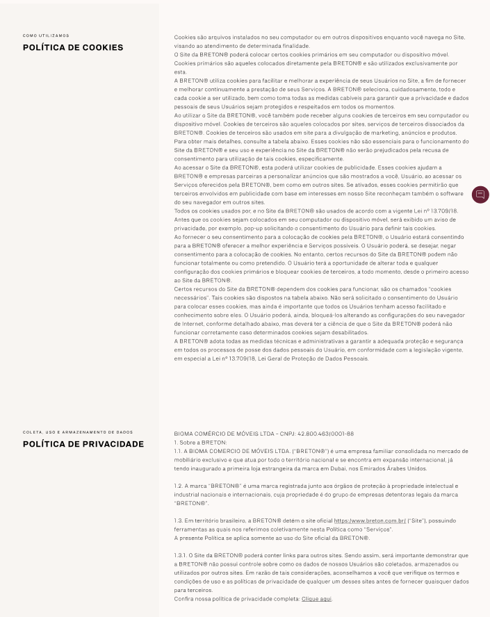
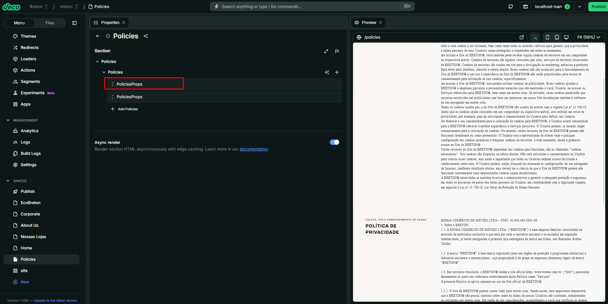
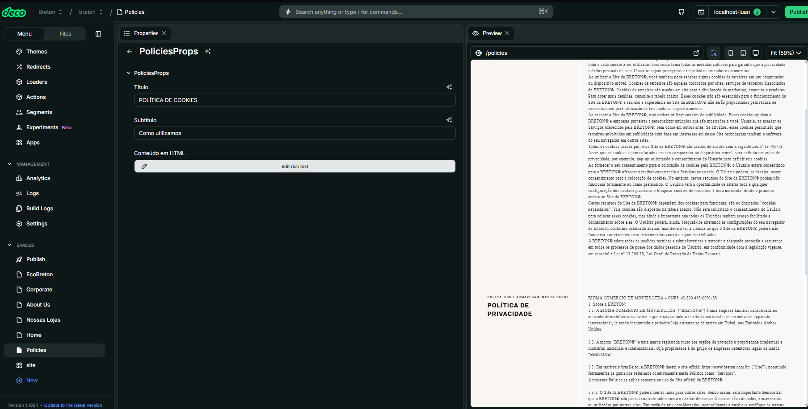

# Nome do Componente  
Policies

## Descrição  
O `Policies` é um componente responsável por exibir uma lista de políticas institucionais ou informativas em formato de seções. Ele é responsivo, adapta-se ao dispositivo do usuário (mobile ou desktop) e permite a personalização de título, subtítulo e conteúdo em HTML para cada bloco de política.

## Previews de Exemplo

### Desktop  

### Mobile  

## Preview Preenchimento no admin da Deco  
*Exemplo de preenchimento dos campos no admin da Deco:*

  

## Props  
Lista de propriedades aceitas pelo componente e seus tipos.

| Propriedade | Tipo               | Obrigatória | Descrição                                                                 | Valor Padrão |
|-------------|--------------------|-------------|---------------------------------------------------------------------------|---------------|
| `policies`  | `PoliciesProps[]`  | Sim         | Lista de objetos contendo as informações de cada política a ser exibida  | -             |

### Estrutura de `PoliciesProps`

| Campo      | Tipo         | Obrigatória | Descrição                                              |
|------------|--------------|-------------|--------------------------------------------------------|
| `title`    | `string`     | Sim         | Título principal da política                           |
| `subtitle` | `string`     | Sim         | Subtítulo/Seção da política                            |
| `text`     | `HTMLWidget` | Sim         | Conteúdo em HTML que será exibido como corpo da política |

## Considerações  
- O componente utiliza `useDevice` para identificar o tipo de dispositivo e aplicar ajustes visuais.
- O conteúdo do campo `text` é renderizado via `dangerouslySetInnerHTML`, permitindo formatações ricas e personalizadas.

## Perguntas Frequentes (FAQ)

### Posso adicionar imagens ou links no campo `text`?
Sim. Como o campo aceita HTML, é possível inserir imagens (``), links (`<a>`) e outras tags HTML, desde que estejam bem formatadas.

### Quantas políticas posso passar no array?
Não há limite técnico definido. Porém, para manter a boa experiência do usuário, recomenda-se usar entre 2 a 5 blocos.
