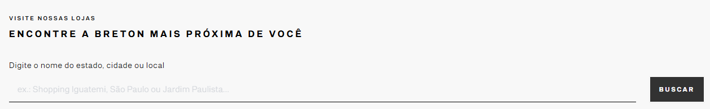
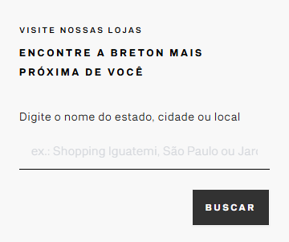
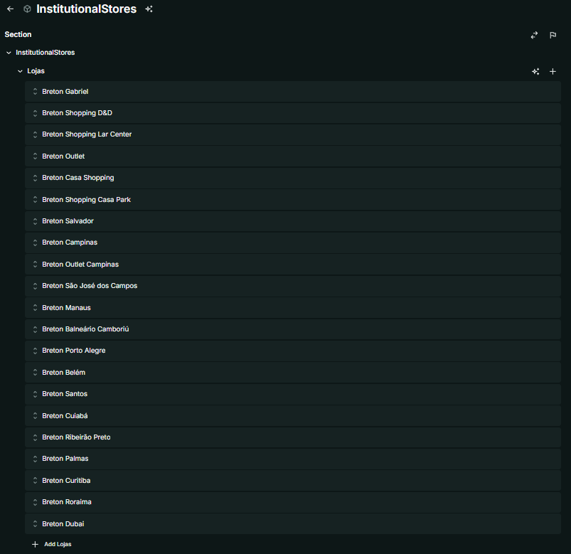
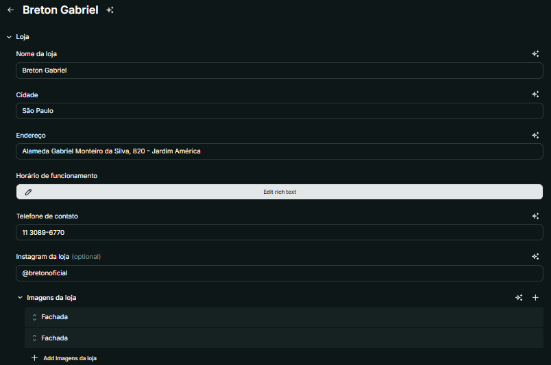
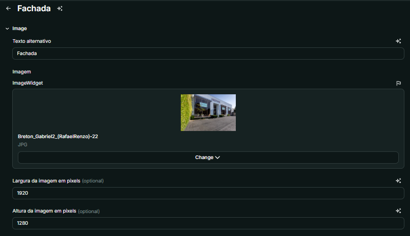

# Nome do Componente
InstitutionalStores

## Descrição
O **InstitutionalStores** é um componente responsável por exibir uma lista de lojas institucionais, permitindo a busca por nome, cidade ou local. Ele inclui informações como endereço, telefone, horário de funcionamento e imagens da loja.

## Previews de Exemplo

### Desktop

### Mobile

## Preview Preenchimento no admin da Deco

##### Listagem de lojas

##### Dados de uma loja

##### Imagens da loja

## Props
Lista de propriedades aceitas pelo componente e seus tipos.

| Propriedade | Tipo | Obrigatória | Descrição | Valor Padrão |
|------------|------|-------------|------------|---------------|
| lojas | Loja[] | Sim | Lista contendo informações das lojas institucionais | - |

### Estrutura do objeto **Loja**

| Propriedade | Tipo | Obrigatória | Descrição |
|------------|------|-------------|------------|
| name | string | Sim | Nome da loja |
| city | string | Sim | Cidade da loja |
| address | string | Sim | Endereço da loja |
| opening | HTMLWidget | Sim | Horário de funcionamento |
| phone | string | Sim | Telefone de contato |
| instagram | string | Não | Link do Instagram da loja |
| images | Image[] | Sim | Lista de imagens da loja |

### Estrutura do objeto **Image**

| Propriedade | Tipo | Obrigatória | Descrição |
|------------|------|-------------|------------|
| alt | string | Sim | Texto alternativo da imagem |
| image | ImageWidget | Sim | URL da imagem |
| width | number | Não | Largura da imagem |
| height | number | Não | Altura da imagem |

## Considerações
- O componente usa **useDevice** para determinar se o usuário está em um dispositivo móvel ou desktop.
- O componente possui uma função **handleInput** a fim de limpar a pesquisa ao apagar o que estava escrito.
- O componente possui uma função **handleSearch** responsável por filtrar o conteúdo ao clicar no botão, mostrando apenas as lojas que possuem o que está digitado entre suas informações.
- Um **carousel de imagens** é utilizado no desktop para exibir as imagens das lojas.
- O **dangerouslySetInnerHTML** é usado para renderizar HTML dinâmico nos horários de funcionamento.
- Existe um **campo de busca** que permite filtrar lojas pelo nome, cidade ou endereço.
- Caso nenhuma loja seja encontrada, é exibida uma mensagem informativa.

## Perguntas Frequentes (FAQ)

### Como funciona a busca de lojas?
O usuário pode digitar o nome do estado, cidade ou local no campo de busca, e as lojas serão filtradas automaticamente.

### O que acontece se não houver lojas correspondentes na busca?
Uma mensagem "Nenhuma loja encontrada!" será exibida caso nenhum resultado seja compatível com a pesquisa.
