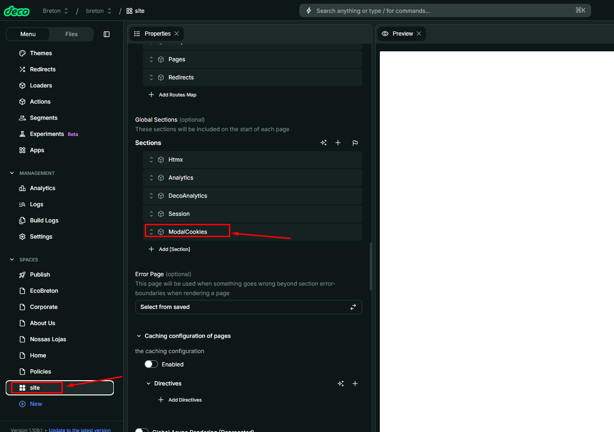
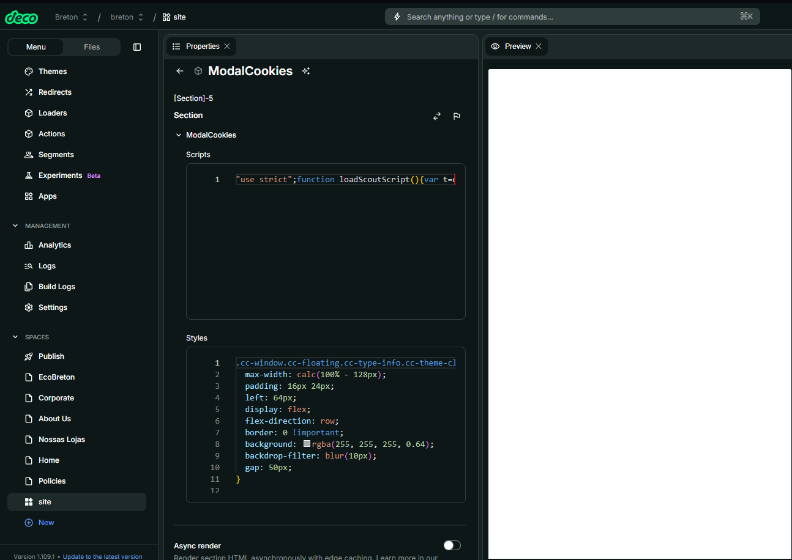

# Nome do Componente  
ModalCookies

## Descrição  
O `ModalCookies` é um componente responsável por injetar dinamicamente no `<head>` da página os scripts e estilos relacionados à gestão de cookies. Ideal para integrações com ferramentas de consentimento de cookies ou personalizações de estilos e funcionalidades desse modal.

## Previews de Exemplo
*Como esse componente atua no `<head>`, ele não possui visualização direta na interface da página. Os efeitos são perceptíveis no comportamento de scripts ou estilizações relacionadas a cookies.*

## Preview Preenchimento no admin da Deco  
*Exemplo de preenchimento dos campos de script e estilo no admin da Deco:*

  

## Props  
Lista de propriedades aceitas pelo componente e seus tipos.

| Propriedade | Tipo        | Obrigatória | Descrição                                                                 | Valor Padrão |
|-------------|-------------|-------------|---------------------------------------------------------------------------|---------------|
| `scripts`   | `TypeScript`| Não         | Código JavaScript que será inserido dentro da tag `<script>` no `<head>` | -             |
| `styles`    | `CSS`       | Não         | Código CSS que será inserido dentro da tag `<style>` no `<head>`         | -             |

## Considerações  
- O `ModalCookies` utiliza `dangerouslySetInnerHTML` para injetar diretamente os códigos fornecidos.

## Perguntas Frequentes (FAQ)

### Posso usar HTML dentro das props?
Não. Apenas códigos JavaScript para `scripts` e CSS puro para `styles`. O conteúdo será injetado diretamente nas tags `<script>` e `<style>`.

### O que acontece se eu deixar uma das props vazia?
Se `scripts` ou `styles` forem omitidos ou estiverem vazios, suas respectivas tags não serão renderizadas.
