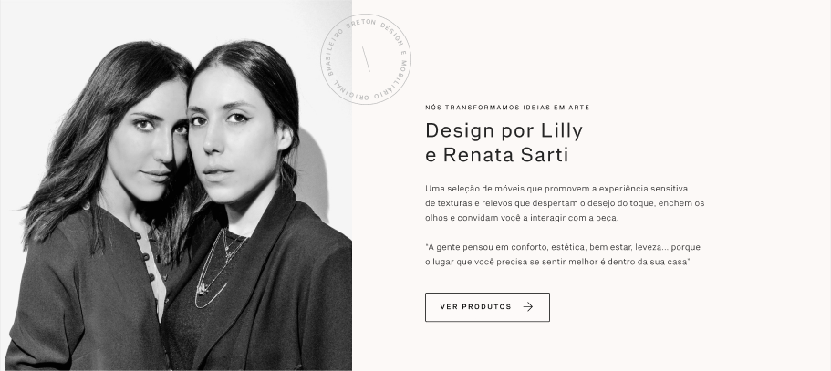
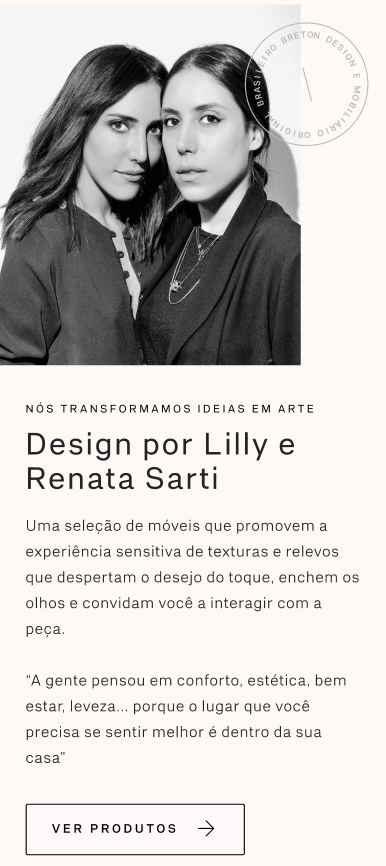
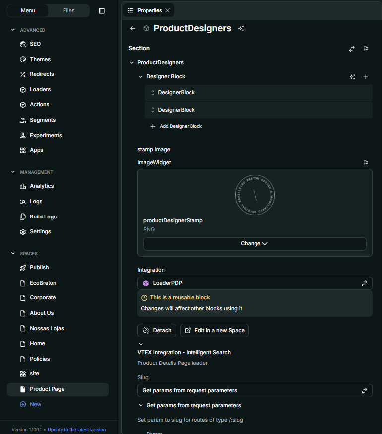
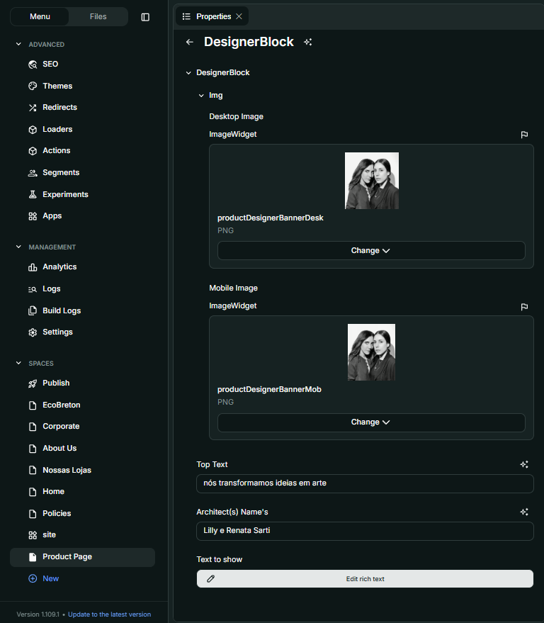

# Componente  
**ProductDesigners**

## Descrição  
`ProductDesigners` é um componente visual que exibe uma seção dedicada aos designers responsáveis por um produto. Ele apresenta imagens (versões para desktop e mobile), informações sobre o(s) arquiteto(s), um texto explicativo e um selo (stamp). Além disso, gera automaticamente um link para a página de produtos relacionados ao designer com base nos dados da página do produto.

## Previews de Exemplo

### Desktop  

### Mobile  

## Preenchimento no Admin da Deco  

## Props  

| Propriedade     | Tipo                                | Obrigatória | Descrição                                                                                   | Valor Padrão |
|----------------|-------------------------------------|-------------|---------------------------------------------------------------------------------------------|---------------|
| `designerBlock` | `DesignerBlock[]`                   | Sim         | Lista de blocos com informações dos designers: imagens, textos e nomes dos arquitetos       | -             |
| `stamp`         | `ImageWidget`                       | Sim         | Imagem do selo (stamp) a ser sobreposta nas imagens                                         | -             |
| `page`          | `ProductDetailsPage \| null`        | Sim         | Objeto da página do produto, usado para identificar o nome do designer                      | -             |

## Tipo: `DesignerBlock`

| Propriedade  | Tipo            | Obrigatória | Descrição                                                | Valor Padrão |
|--------------|------------------|-------------|------------------------------------------------------------|---------------|
| `img.desktop` | `ImageWidget`    | Sim         | Imagem para a versão desktop                              | -             |
| `img.mobile`  | `ImageWidget`    | Sim         | Imagem para a versão mobile                               | -             |
| `topText`     | `string`         | Sim         | Texto superior exibido acima do nome do arquiteto         | -             |
| `architects`  | `string`         | Sim         | Nome(s) do(s) arquiteto(s) associado(s) ao bloco           | -             |
| `text`        | `HTMLWidget`     | Sim         | Texto descritivo sobre o designer                          | -             |

## Considerações  
- Apenas os blocos cujo campo `architects` inclui o nome encontrado na propriedade `Designer` do produto são exibidos.
- O botão “VER PRODUTOS” redireciona para uma página filtrada por marca e designer.

## Perguntas Frequentes (FAQ)

### Como funciona o filtro de designers?  
O componente busca o nome do designer na propriedade `Designer` da página do produto (`page`) e exibe apenas os blocos cujo campo `architects` contenha esse nome.

### Posso exibir mais de um bloco ao mesmo tempo?  
Sim. Se o nome do designer estiver presente em múltiplos blocos, todos serão renderizados.

### O selo (stamp) aparece em todas as versões?  
Sim. O selo é sobreposto tanto nas imagens desktop quanto mobile.
