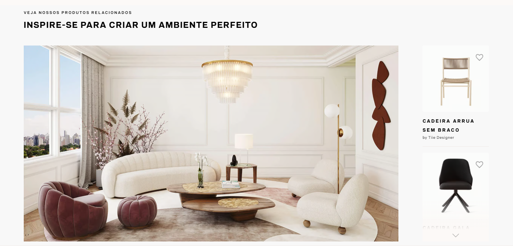
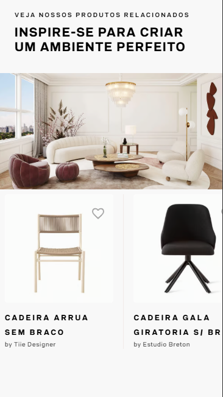
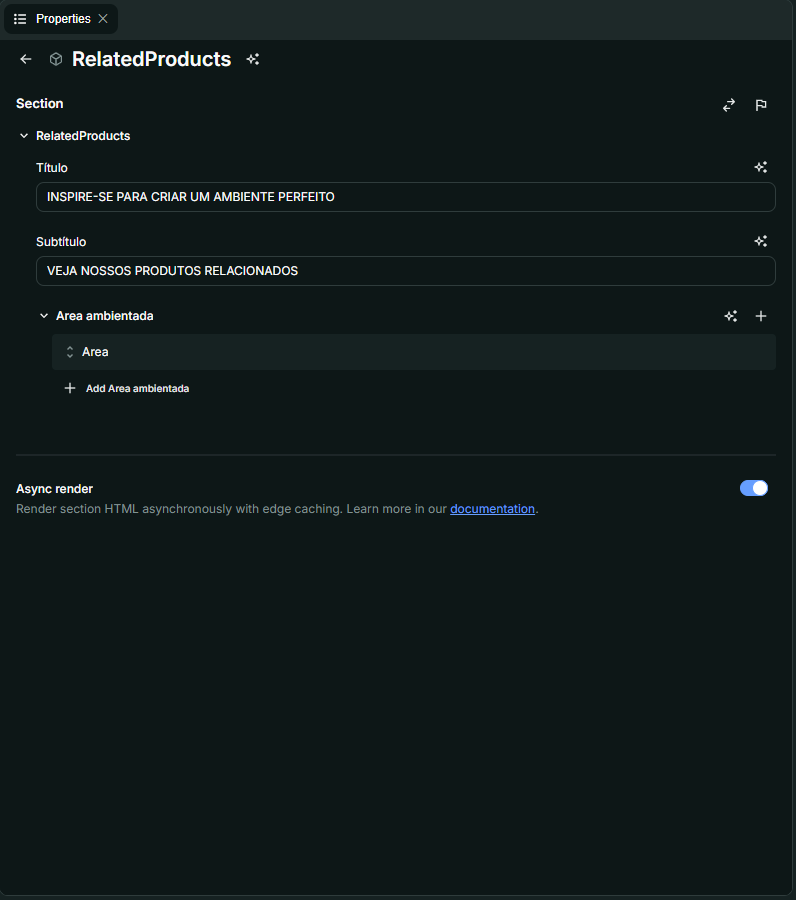
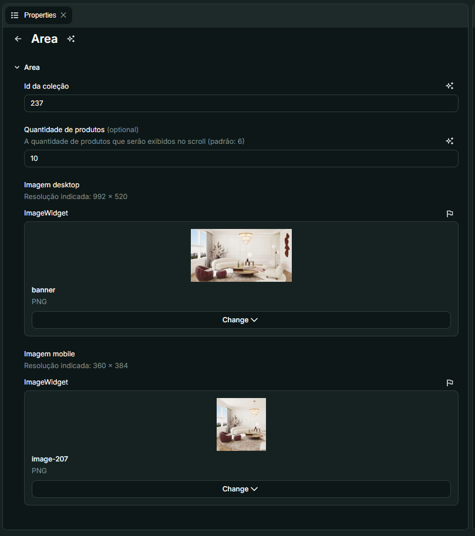

# Nome do Componente
RelatedProducts

## Descrição
O **RelatedProducts** é um componente que exibe produtos relacionados ao item visualizado, agrupados por áreas/clusters. Ele mostra:
- Uma imagem de ambiente (diferente para desktop/mobile)
- Um carrossel de produtos relacionados
- Controles de scroll personalizados para navegação

## Previews de Exemplo

### Desktop

### Mobile

## Preview Preenchimento no admin da Deco

#### Informações iniciais - gerais

#### Informações específicas de cada área/cluster/coleção

## Props
| Propriedade | Tipo | Obrigatória | Descrição | Valor Padrão |
|------------|------|-------------|-----------|--------------|
| page | ProductDetailsPage \| null | Sim | Dados da página de produto atual (loader da Deco - PDP) | - |
| title | string | Sim | Título principal do componente | - |
| subtitle | string | Sim | Subtítulo do componente | - |
| areas | Area[] | Sim | Lista de áreas/clusters com configurações | - |

### Estrutura do objeto **Area**
| Propriedade | Tipo | Obrigatória | Descrição |
|------------|------|-------------|-----------|
| collectionId | number | Sim | ID da coleção/cluster no VTEX |
| count | number | Não | Quantidade de produtos a exibir (padrão: 6) |
| desktopImage | ImageWidget | Sim | Imagem para desktop (992x520px recomendado) |
| mobileImage | ImageWidget | Sim | Imagem para mobile (360x384px recomendado) |

## Considerações
- **Integração VTEX**: O componente usa `collectionId` para buscar produtos relacionados através da API Intelligent Search
- **Responsividade**: Exibe layouts diferentes para mobile/desktop
- **Scroll personalizado**: 
  - No desktop, mostra sombras e setas para indicar scroll disponível
  - No mobile, usa carrossel horizontal padrão
- **Lógica de cluster**: Relaciona produtos baseado na propriedade `cluster` do produto atual
- **Performance**: 
  - Imagens são carregadas lazy
  - A busca por produtos relacionados é feita apenas quando há match de cluster

## Perguntas Frequentes (FAQ)

### Como os produtos relacionados são determinados?
Através da propriedade `cluster` do produto atual, que deve corresponder ao `collectionId` configurado no admin.

### O que acontece se não houver produtos relacionados?
O componente não é renderizado caso não encontre produtos correspondentes ao cluster.

### Posso controlar quantos produtos são exibidos?
Sim, através da propriedade `count` em cada área (valor padrão é 6).

### Como configurar as imagens de ambiente?
No admin, para cada área, preencher com uma imagem desejada, seja realizando um upload no próprio CMS Deco ou utilizando o link de uma imagem em um servidor, como AWS