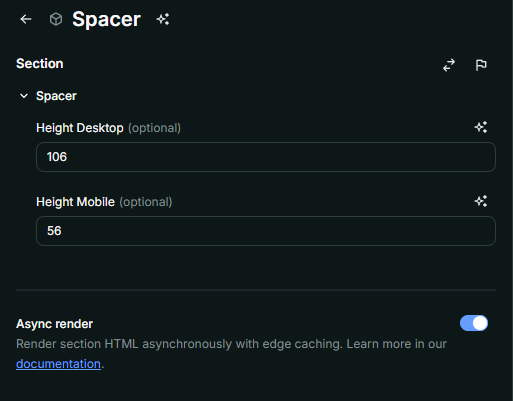

# Nome do Componente
Spacer

## Descrição
O `Spacer` é um componente utilizado para criar espaçamentos verticais responsivos entre elementos da interface. Ele permite definir alturas diferentes para dispositivos desktop e mobile.

## Preview Preenchimento no admin da Deco

## Props
Lista de propriedades aceitas pelo componente e seus tipos.

| Propriedade | Tipo | Obrigatória | Descrição | Valor Padrão |
|------------|------|-------------|------------|---------------|
| `heightDesktop` | `number` | Não | Altura do espaçamento em pixels para desktop | `80` |
| `heightMobile` | `number` | Não | Altura do espaçamento em pixels para mobile | `80` |

## Considerações
- O `Spacer` cria dois elementos distintos para gerenciar espaçamento em dispositivos desktop e mobile.
- O espaçamento é responsivo e se adapta conforme a largura da tela.

## Perguntas Frequentes (FAQ)

### O `Spacer` pode ser usado para espaçamentos flexíveis?
Sim, ele permite definir espaços personalizados através das props `heightDesktop` e `heightMobile`.

