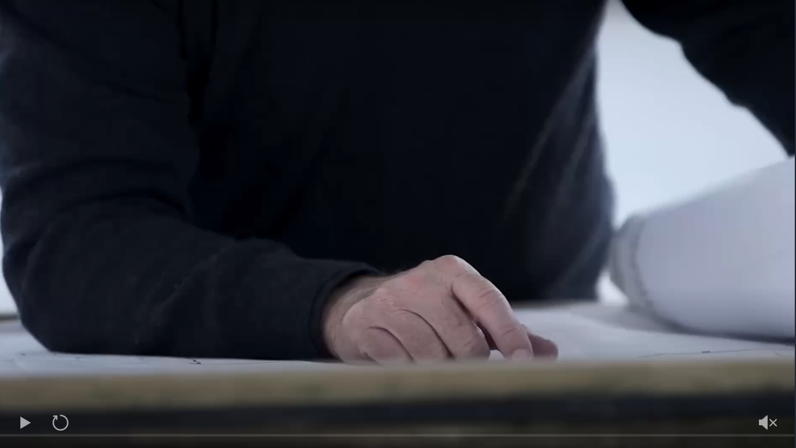
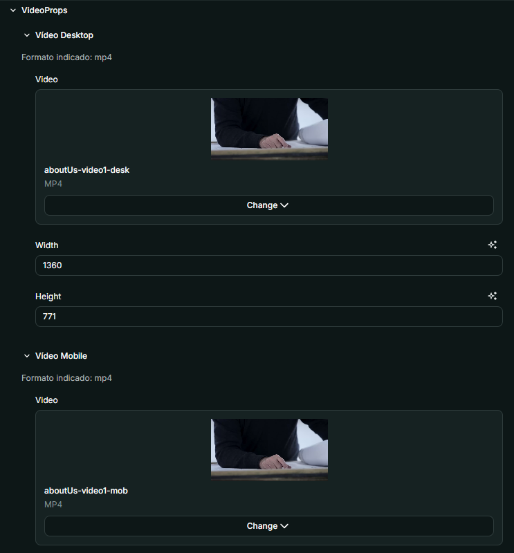
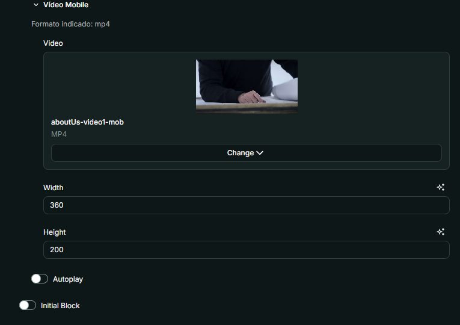

# Nome do Componente
Video

## Descrição
O `Video` é um componente responsável por exibir vídeos responsivos para dispositivos móveis e desktop. Ele suporta reprodução automática, controles personalizados e ajuste dinâmico da proporção de tela. É importante se atentar que caso deseje um componente que possa ser alterado entre vídeo e banner recomendamos o `VideoOrImage`.

## Previews de Exemplo

### Desktop

### Mobile

## Preview Preenchimento no admin da Deco

## Props
Lista de propriedades aceitas pelo componente e seus tipos.

| Propriedade | Tipo | Obrigatória | Descrição | Valor Padrão |
|------------|------|-------------|------------|---------------|
| `videoDesktop` | `object` | Sim | Contém o vídeo e suas dimensões para desktop | - |
| `videoMobile` | `object` | Sim | Contém o vídeo e suas dimensões para mobile | - |
| `autoplay` | `boolean` | Não | Define se o vídeo deve iniciar automaticamente | `false` |
| `initialBlock` | `boolean` | Não | Define se o vídeo é o primeiro bloco da página | `false` |

## Considerações
- O `VideoWidget` utiliza `useDevice` para determinar se deve exibir o vídeo mobile ou desktop.
- O ajuste da proporção de tela é feito dinamicamente com base nas dimensões do vídeo fornecido.
- O componente inclui controles personalizados para reproduzir, mutar e reiniciar o vídeo.
- Para que os controles funcionem corretamente, o JavaScript embutido deve ser carregado.

## Perguntas Frequentes (FAQ)

### O que acontece se eu não definir `videoDesktop` ou `videoMobile`?
O componente não será renderizado corretamente, pois pelo menos um vídeo deve ser definido.

### O vídeo pode ser reproduzido automaticamente?
Sim, basta definir a propriedade `autoplay` como `true`.

### Os controles do vídeo podem ser personalizados?
Os controles padrão incluem play/pause, mute/unmute e reset. Para mais personalização, o componente pode ser modificado.

### O que acontece se `initialBlock` estiver ativado?
Caso `initialBlock` esteja ativado, o vídeo será posicionado no topo da página com espaçamento ajustado para diferentes dispositivos.

