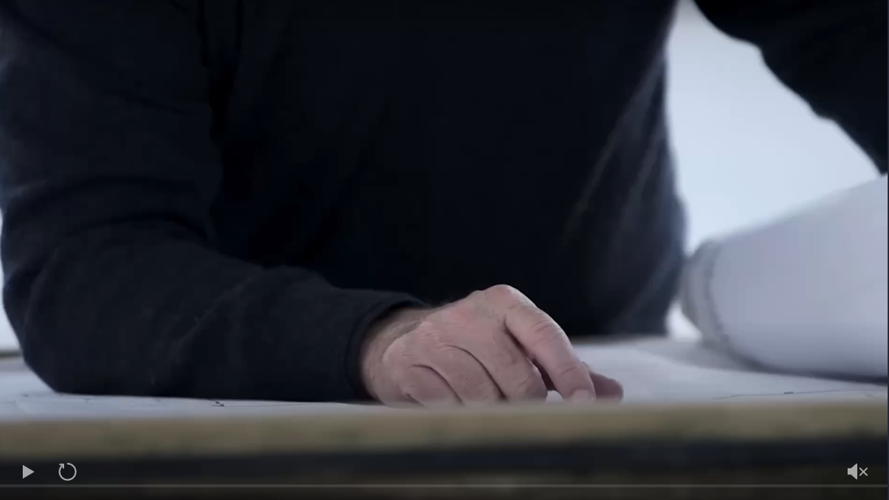
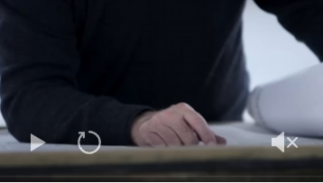
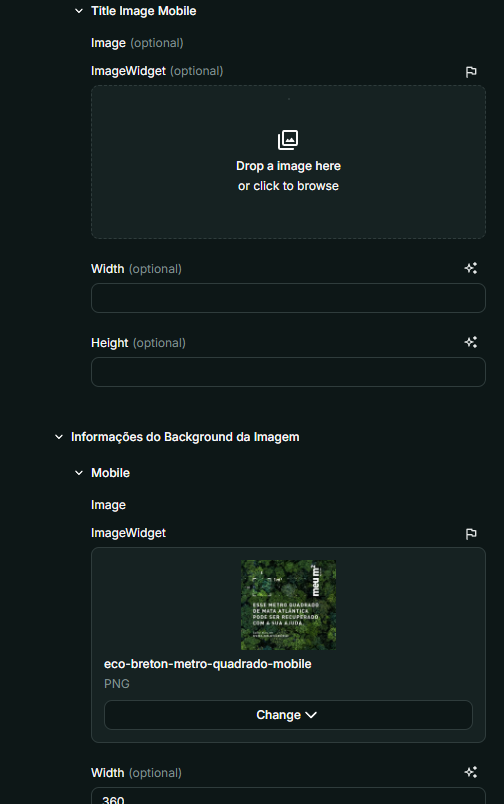
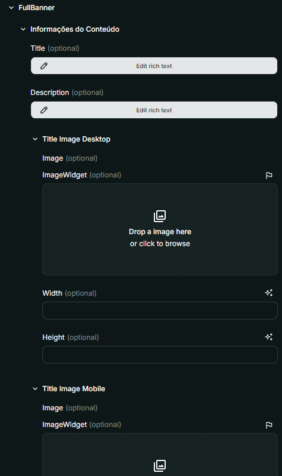
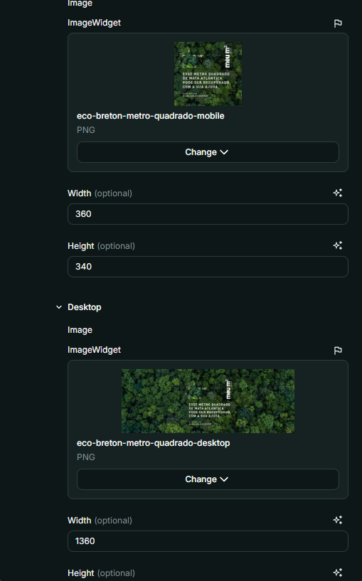
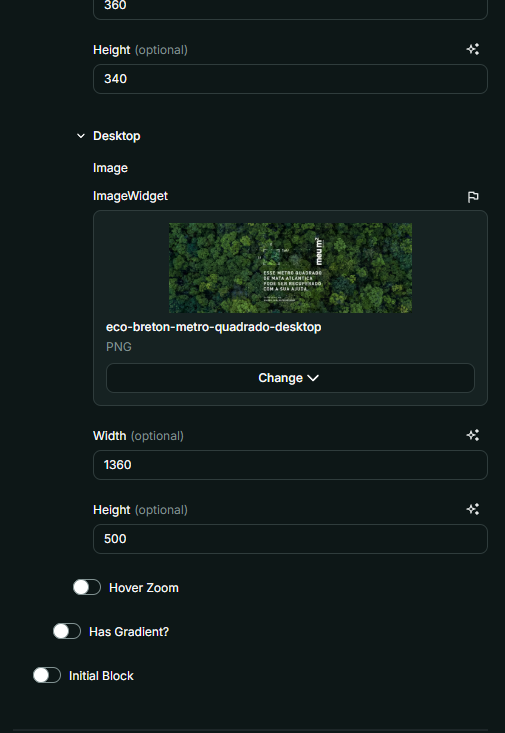
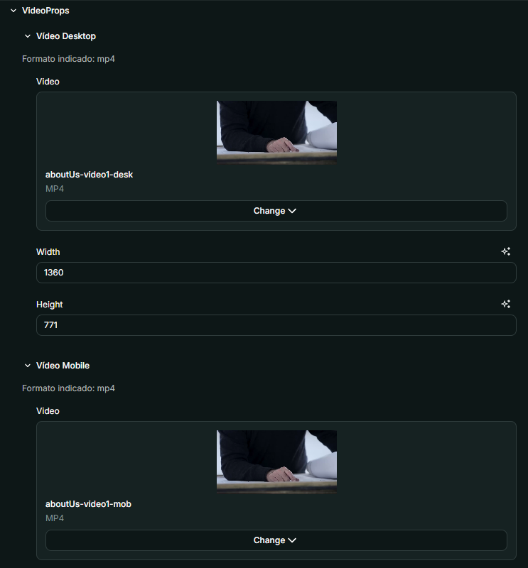
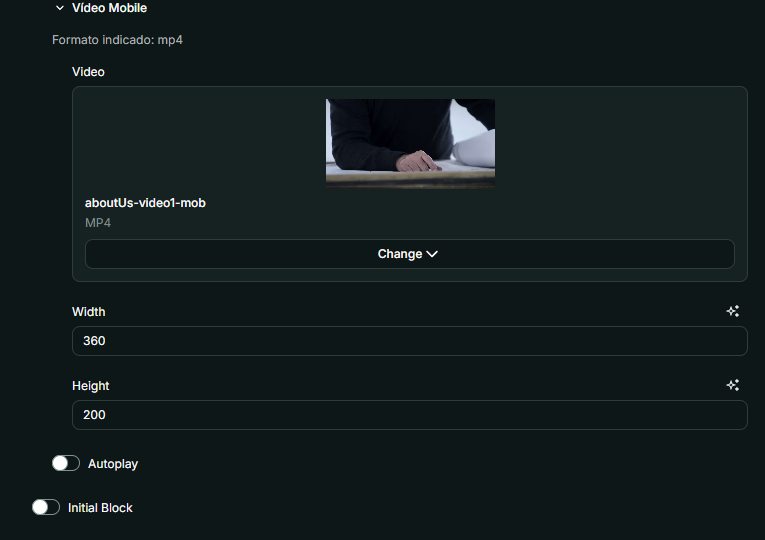

# Nome do Componente
VideoOrImage

## Descrição
O `VideoOrImage` é um componente que permite exibir um vídeo ou uma imagem como banner, dependendo da configuração definida pelo usuário. Ele suporta o uso do `FullBanner` para imagens e do `VideoWidget` para vídeos.

## Previews de Exemplo

### Desktop (FullBanner)

### Desktop (Video)

### Mobile (FullBanner)

### Mobile (Video)

## Preview Preenchimento no admin da Deco (FullBanner)

## Preview Preenchimento no admin da Deco (Video)

## Props
Lista de propriedades aceitas pelo componente e seus tipos.

| Propriedade | Tipo | Obrigatória | Descrição | Valor Padrão |
|------------|------|-------------|------------|---------------|
| `mediaType` | `VideoProperties` `FullBannerProps` | Sim | Define se será exibido um vídeo ou uma imagem como banner | - |
| `initialBlock` | `boolean` | Não | Define se o bloco será o primeiro da página | `false` |

## Considerações
- O `VideoOrImage` identifica automaticamente se a mídia fornecida é um vídeo ou uma imagem.
- Caso um `background` esteja presente, será renderizado um `FullBanner`.
- Se um `videoDesktop` estiver presente, será renderizado um `VideoWidget`.
- O ajuste da mídia acontece dinamicamente com base nas propriedades fornecidas.

## Perguntas Frequentes (FAQ)

### O que acontece se eu não definir `mediaType`?
O componente não será renderizado corretamente, pois é necessário definir se a mídia será uma imagem (`FullBanner`) ou um vídeo (`VideoWidget`).

### Posso usar este componente para alternar entre vídeo e imagem automaticamente?
Não, a escolha entre vídeo ou imagem deve ser feita manualmente ao definir a propriedade `mediaType`.

### Como funciona a propriedade `initialBlock`?
Caso `initialBlock` esteja ativado, o componente será ajustado para aparecer como o primeiro bloco da página, garantindo o espaçamento adequado para diferentes dispositivos.

